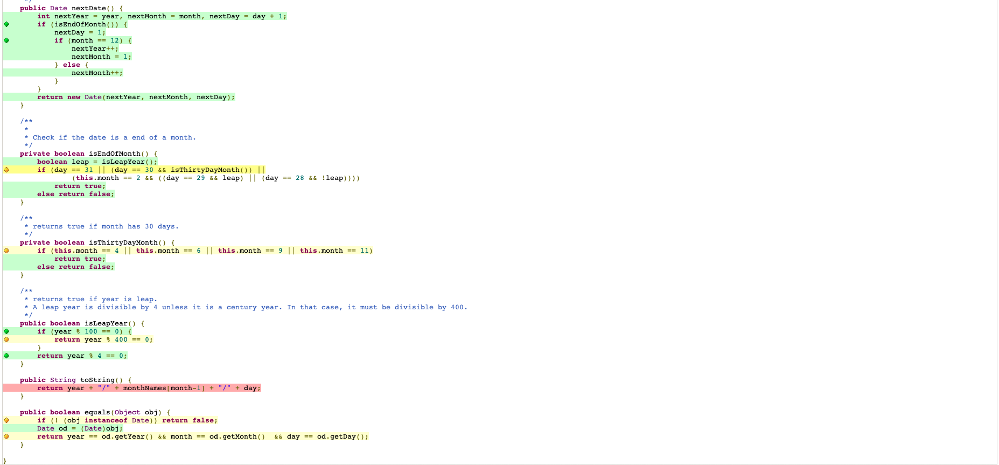

# Lab 03

| Outline | Value |
| --- | --- |
| Course | SEG 3X03 |
| Date | Summer 2021 |
| Professor | Andrew Forward, aforward@uottawa.ca |
| TA | James Url, jamesurl@uottawa.ca |
| Team | Andrew Forward 1484511 Ayana Forward 9021000 |

## Analyze Computation results
### Computation

Ran and generated the report for Computation:

Analyzed the class coverage:

We notice that there was a 1/2 branch missed "if(a == Integer.MIN_VALUE)", Similarly for catchexception at "if(i == 13)" and for divide at "if (divident == 0)".
We also see that there is no coverage for susbtract method as the test call was blank ("// do nothing").

### Date
Ran and generated the report for Date:

Analyzed the class coverage:

We notice that the 3 first if statements were not fully covered. We also see that toString hasn't been covered either.