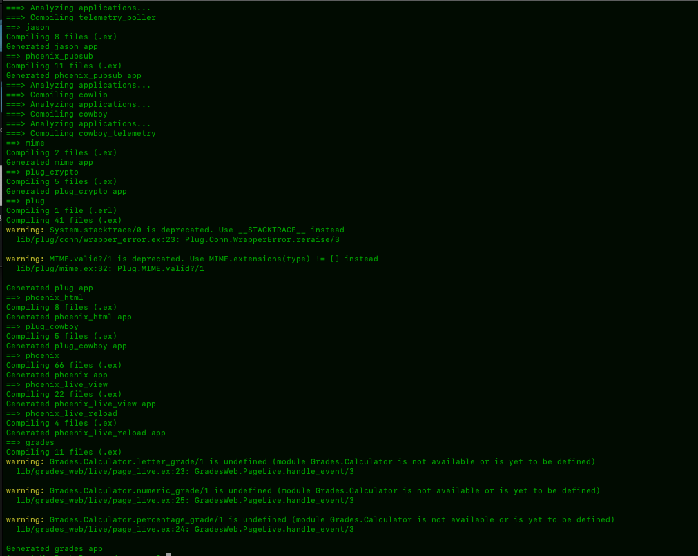
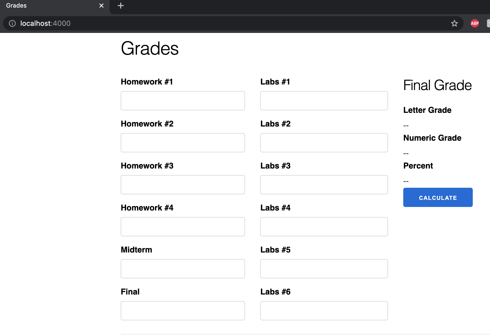
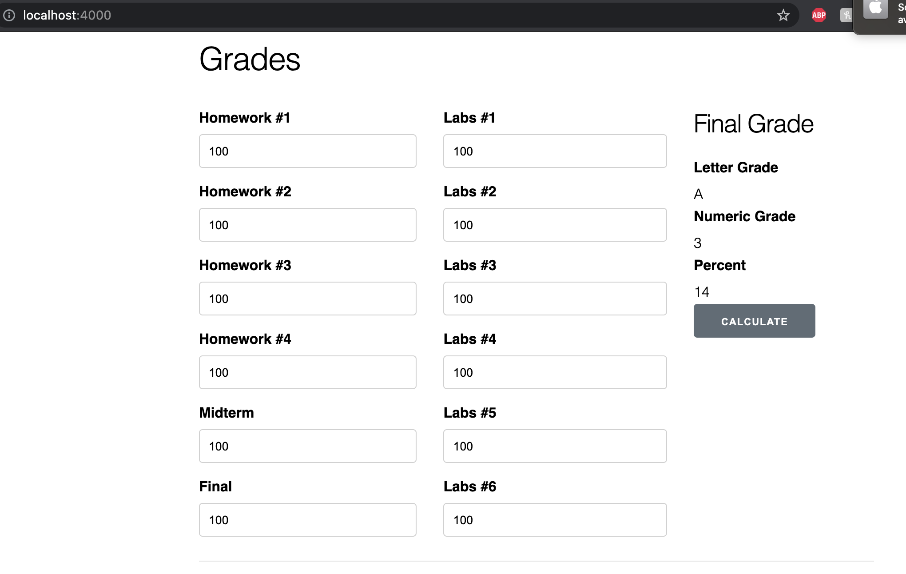

# Lab 05

| Outline | Value |
| --- | --- |
| Course | SEG 3X03 |
| Date | Summer 2021 |
| Professor | Andrew Forward, aforward@uottawa.ca |
| TA | James Url, jamesurl@uottawa.ca |
| Team | Andrew Forward 1484511 Ayana Forward 9021000 |

## Grades

### Grades compiling and running

### Grades app after Stub

We noticed that with the stub functions, the letter, numeric and precent grades are not corresponding to each other and they can all be different.

## Twitter

### Implemented the 4 missing Twitter test cases
[4 Missing Tests](https://github.com/bahmed24/seg3103_playground/commit/caa1bf5dcabc61863128b9d57b7c388ad1f00523)

### Passing test
