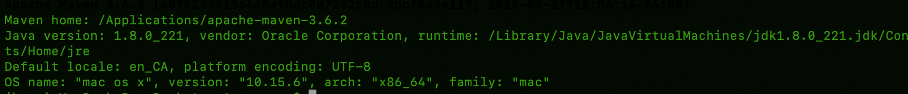
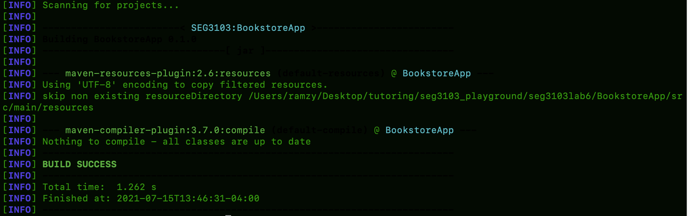

# Lab 06

| Outline | Value |
| --- | --- |
| Course | SEG 3X03 |
| Date | Summer 2021 |
| Professor | Andrew Forward, aforward@uottawa.ca |
| TA | James Url, jamesurl@uottawa.ca |
| Team | Andrew Forward 1484511 Ayana Forward 9021000 |

## Output of "mvn -version"

## Output of "mvn compile"

## Output of "mvn package -DskipTests" 

## Output of "java -jar ./target/BookstoreApp-0.1.0.jar"

## Output of "mvn test"

We notice that the test were not passing due to the web server... It seems that through the test connection to the server was never established (can't reach localhost:8080)
To test behaviour, I changed the link to a https://facebook.com and the test was running. 

## Screenshot of additional selenium web driver test
Added Two selenium Test: searching functionality and adding a book as an admin
Refer to the two tests here:
[Additional tests](https://github.com/bahmed24/seg3103_playground/commit/486e9cdd2a60a11dcdab7b0545a414ef60393233#diff-d8564271f9f2341a0c56944d7126871d0a8f5b12c22ff649b333390607d84c6c)
