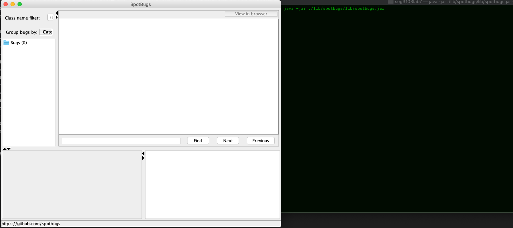

# Lab 07

| Outline | Value |
| --- | --- |
| Course | SEG 3X03 |
| Date | Summer 2021 |
| Professor | Andrew Forward, aforward@uottawa.ca |
| TA | James Url, jamesurl@uottawa.ca |
| Team | Andrew Forward 1484511 Ayana Forward 9021000 |

## Code compiling and running

## Run SpotBugs

## SpotBugs linked to calculator: bugs report

## Output of "java -jar ./target/BookstoreApp-0.1.0.jar"

## Result analysis

    - Bad practices: Comparing Strings using == or !=. For this bug, we can use '.equals()' to compare strings as a best practice.
    - Call to swing method in Main: For this, we can fix it by implementing a container for the threads to contain the method events.
    - The class Calcframe could be refactored: This class is an inner class, but does not use its embedded reference to the object which created it.  So a quick fix here is to make the class a static inner class.
    - Boxing/unboxing to parse a primitive error x2: This can be fixed by calling a static parse method.
    - Unread field x4: These fields can be made static. This will fix the issue.
    - Same code for two branches: Seems like a duplicate code. We can remove the else if and just keep the second branch.
    - Switch statement: It seems that the default case in the switch block switch is missing, this can be fixed by implementing a default case.
    - Useless condition x3: This condition always produces the same result as the value of the involved variable that was narrowed before. In this situation, we can refactor the conditions to avoid any duplications. E.g: if i>7 ... to cover up all the cases where i is greater than or equal to 8. From there we can cover up the smaller condition: else if i>2 to cover up the condition where i is between 3 and 7.
    - Useless condition for morenums: At that point its gonna be true so it could be just removed and move directly to the next if statement.

